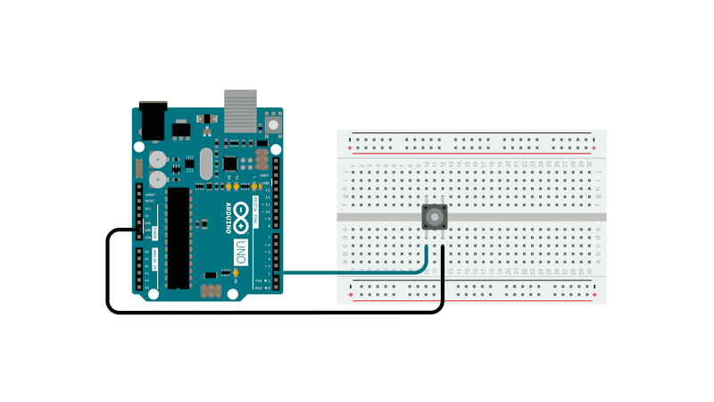

# Cours 02 - Rappel Arduino <!-- omit in toc -->

# Plan de leçon
- La fonction `digitalRead()`

# digitalRead()
- Nous avons vu la fonction `digitalWrite()` dernièrement pour activer ou désactiver une sortie numérique.
- Il y aussi la fonction complémentaire `digitalRead()` qui permet de lire l'état d'une entrée numérique.
- La fonction `digitalRead()` retourne un `int` qui peut être 0 ou 1.
- Elle sert par exemple à lire l'état d'un bouton poussoir.
- Dans la leçon actuelle, il faudra faire un montage avec un bouton poussoir et une résistance.

# Brancher un bouton

> **Attention!** Ce montage spécifique n'utilise pas de résistance explicite. Il faut utiliser la résistance interne de l'Arduino avec le mode `INPUT_PULLUP`.
> 
> Généralement, on utilise une résistance de 10kΩ pour ce genre de montage.

<table>
<tr>
<td>

- Reproduire le montage ci-contre.
- Matériel requis
  - Bouton poussoir
  - 2 fils

</td>
<td>



</td>
</tr>
</table>

Le code d'accompgnement est le suivant :

```cpp
short btnPin = 2; // Broche 2
short ledPin = LED_BUILTIN; // Broche 13

void setup() {
  // IMPORTANT! On configure la pin 2 en entrée 
  // avec une résistance de pullup
  pinMode(btnPin, INPUT_PULLUP);
  pinMode(ledPin, OUTPUT);
}

void loop() {
  // On lit l'état de la pin 2
  int buttonState = digitalRead(btnPin);

  // On écrit l'état dans la pin 13
  digitalWrite(ledPin, buttonState);
}
```

---

# Références
- [Dépôt de code du cours](https://github.com/nbourre/1SX_robotique)
- [Livre O'Reilly : Chapitre 4](https://www.oreilly.com/library/view/arduino-cookbook/9781449399368/ch04.html)

---

**[Retour au sommaire de la leçon](./readme.md)**