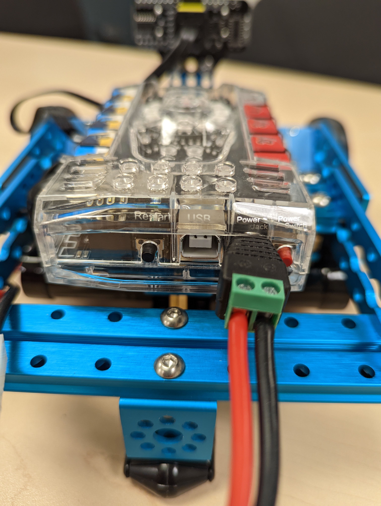
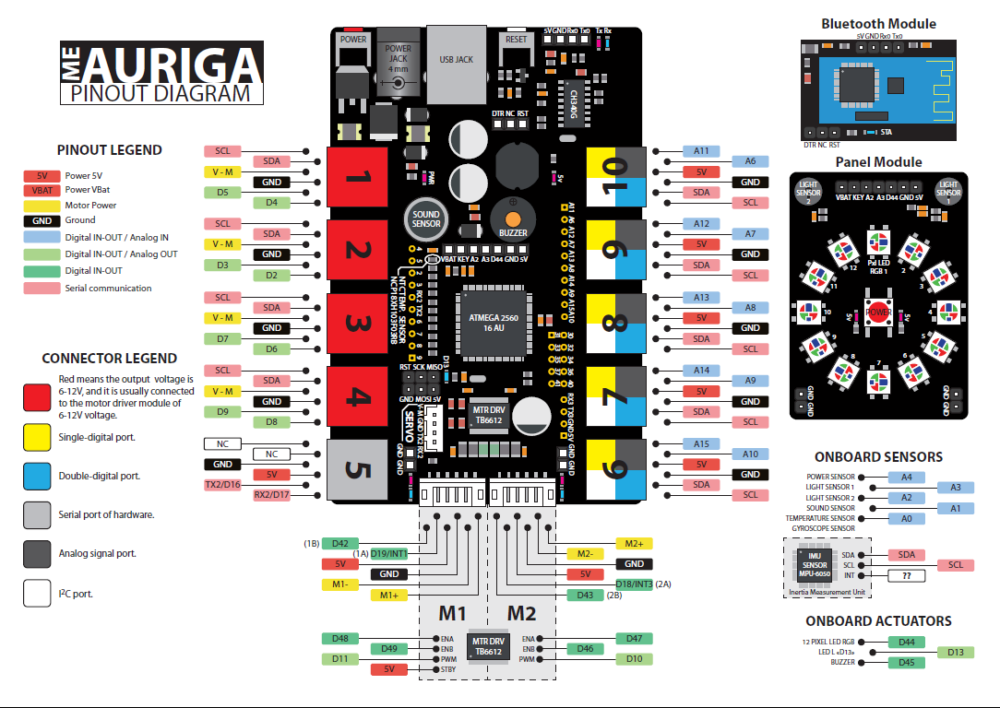

# Robot Ranger

---

# Plan de leçon

- MakeBlock mBot Ranger
- Spécifications
- Différences avec le Arduino Mega
- Premier code

---

# mBot Ranger de MakeBlock
- Le robot utilisé sera le mBot Ranger de la compagnie MakeBlock
- [Page officielle](https://www.makeblock.com/steam-kits/mbot-ranger)
  

---
# Spécifications
- Moteurs avec encodeur
- Châssis en aluminium
- Capteur ultrason
- Capteur de lignes
- Capteur de température, de lumière (x2), de puissance
- Un *buzzer*
- Expansible
- Carte-mère compatible avec le Arduino Mega
- 

---
# Le robot

- Capteur ultrason

---

- Code d'identification associé à l'étudiant
---

- Anneau de DEL RGB
- Bouton de mise sous tension
- Identifiant pour les ports de connexion
- Compatible avec Lego
---

- Capteur de lignes
- Bloc de batterie rechargeable
- Roulette
---

- Moteur avec encodeur intégré
---

- Bouton de mise sous tensio
- Bouton de remise à zéro
- Port USB type B
- Port d'alimentation
---
# Pin out

- Observer les différentes étiquettes, elles font références aux différentes broches du Arduino

## Points saillants
- Les broches SDA et SDL sont représentées à plusieurs reprises
- Une anneau de DEL RGB
- Un MPU-6050
- Un module Bluetooth
---

# Différences avec le Arduino Mega
- Plusieurs ports sont occupés par les différents composants
  - Voir le Pin out
- Les ports de connexion sont compatibles avec les connecteurs RJ25
- 
---

# Configuration de l'environnement
- Avoir la dernière version de l'Arduino IDE
- Télécharger la dernière version des librairies MakeBlock
  - https://github.com/Makeblock-official/Makeblock-Libraries/releases/latest
  - Si ça ne fonctionne pas télécharger cette [version](https://github.com/s-urbaniak/Makeblock-Libraries/tree/fix-supervariable)
    - Au moment d'écrire ces lignes, il y avait un bogue avec une fonction.
    - Possibilité de corriger le bogue en modifiant le type de retour de `void *` pour `bool` à l'endroit de l'erreur.
- Pour installer une librairie ZIP dans Arduino IDE
  - Sketch --> Include Library --> Add .ZIP Library...

---

# Premier test
- Dans les exemples de `MakeBlockDrive`, récupérer l'exemple `ME_RGBLEd`  `ColorLoopTestAuriga`
- Compiler l'application
- Téléverser le projet sur le robot

---

# Analyse du code `ME_RGBLEd`  `ColorLoopTestAuriga`
- Les classes de MakeBlock débutent avec le préfix `Me`
  - Exemples : MeRGBLed 

---
# TODO : Corriger l'adresse du Gyro
---
# Exercices
- À l'aide des exemples, faites 
---
# Références
- <a href="https://support.makeblock.com/hc/en-us/articles/1500004053721-Programming-mBot-Ranger-in-Arduino" target="_blank">Programming mBot Ranger in Arduino</a>