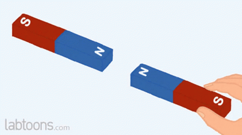
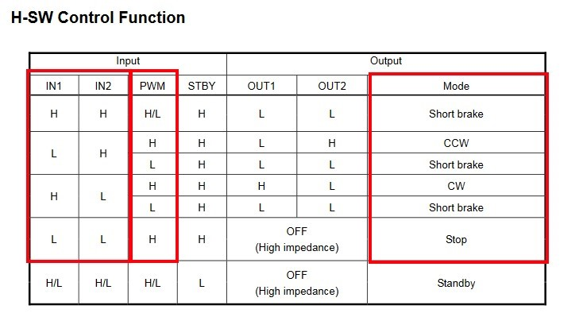

# Le déplacement <!-- omit in toc -->

## Plan de leçon
- Les moteurs du robot
- Comment fonctionne un moteur
- 
---

# Les moteurs du robot
- Le robot a deux moteurs d'installer.
- Dans un premier temps, nous allons utiliser mes librairies
- Dans un second temps soit après la relâche, nous utiliserons les librairies officielles.

---

# Comment fonctionne un moteur
## Principes de base - magnétisme
- Avant toute chose, il faut se rappeler que les aimants s'attirent avec les pôles opposés et se répulsent dans le cas inverse.
- En résumé : Nord-Sud ça colle, Nord-Nord ça s'éloigne




---
## Principes de base - moteur
- Un moteur est composé d'aimants permanents et de bobinnes de fil
- Lorsqu'il y a du courant dans une bobinne, elle devient un aimant, donc elle a un sens Nord-Sud.
- Lorsque la bobine n'a plus de courant, elle ne génère plus de champ magnétique
- À l'intérieur du moteur, les aimants et bobinnes sont disposés de manière à ce que lorsqu'on applique du courant, les bobinnes sont attirés vers les aimants et celles-ci se déconnectent à un certain point donc perd le courant.
- L'inertie de la bobine fait en sorte que celle-ci continue sont chemin et reprend contact avec le courant.
  


- Remarquez dans l'image la petite encoche dans le cylindre jaune sur l'essieu. C'est à cet endroit où les bobines perdent le courant.

---

## Moteur sur le robot
- Maintenant qu'on connaît les principles de base, on va pouvoir comprendre la logique derrière le code.
- Selon le schéma électrique et la documentation, l'Auriga possède un contrôleur de moteur [TB6612](https://learn.adafruit.com/adafruit-tb6612-h-bridge-dc-stepper-motor-driver-breakout)
- Voici un tableau que j'ai récupéré sur la feuille de données (*datasheet*) du [TB6612](https://cdn-shop.adafruit.com/datasheets/TB6612FNG_datasheet_en_20121101.pdf)
  
- J'ai encadré ce qui était d'intérêt pour les programmeurs
- Selon la documentation :
  - les broches 48, 49 et 11 sont respectivement les `IN1`, `IN2` et `PWM` du moteur 1
  - les broches 47, 46 et 10 sont respectivement les `IN1` et `IN2` et `PWM` du moteur 2

- Regardons le code ci-bas

```cpp
int maxPwm = 255;

//Motor right
const int m1_pwm = 11;
const int m1_IN2 = 49; // M1 ENB
const int m1_IN1 = 48; // M1 ENA

/// Vitesse ridicule!!
void FullSpeedMode() {
  digitalWrite(m1_IN2, LOW);
  digitalWrite(m1_IN1, HIGH);
  analogWrite(m1_pwm, maxPwm);
}
```

- Cette fonction écrit l'état pour les broches qui sont dans le tableau.
- **Question** : Si on se réfère au tableau, que fera le moteur?

<details><summary>Cliquer pour voir le code complet</summary>

```cpp
/**
 * @file         ranger_moteur_sans_librairie
 * @author       Nicolas Bourré
 * @version      V1.0
 * @date         2022/10/03
 * @description  this file is sample code for the mBot Ranger kit
 */

//enum State {DRIVING, TURN, STOP, MAX_STATE};
enum State {DRIVING, STOP, MAX_STATE};

State currentState = STOP;

long currentTime = 0;

long statePrevious = 0;
int stateDelay = 3000;

int maxPwm = 255;
int halfPwm = 125;
int turnPwm = 150;

//Motor Left
const int m1_pwm = 11;
const int m1_in1 = 48; // M1 ENA
const int m1_in2 = 49; // M1 ENB

//Motor Right
const int m2_pwm = 10;
const int m2_in1 = 47; // M2 ENA
const int m2_in2 = 46; // M2 ENB

void setup() {
  Serial.begin(9600);

  pinMode(m1_pwm, OUTPUT);  //We have to set PWM pin as output
  pinMode(m1_in2, OUTPUT);  //Logic pins are also set as output
  pinMode(m1_in1, OUTPUT);

  pinMode(m2_pwm, OUTPUT);  //We have to set PWM pin as output
  pinMode(m2_in2, OUTPUT);  //Logic pins are also set as output
  pinMode(m2_in1, OUTPUT);

  currentTime = millis();
}

void loop() {
  currentTime = millis();

  switch (currentState){
    case DRIVING:
      ReduceSpeed();
      break;
    case STOP:
      Stop();      
      break;
    default:
      currentState = STOP;
  }

  if (currentTime - statePrevious >=  stateDelay) {
    statePrevious = currentTime;    
    currentState = (currentState + 1) % MAX_STATE;
    Serial.print ("Entering state : ");
  }
}

void printState() {
  switch (currentState){
    case DRIVING:
      Serial.println ("DRIVING");
      break;
    case STOP:
      Serial.println ("STOPPED");
      break;
    default:
      Serial.println ("UNKNOWNED STATE");
  }  
}

void FullSpeedMode() {
  digitalWrite(m1_in2, LOW);
  digitalWrite(m1_in1, HIGH);
  analogWrite(m1_pwm, maxPwm);

  digitalWrite(m2_in2, HIGH);
  digitalWrite(m2_in1, LOW);
  analogWrite(m2_pwm, maxPwm);
}

void ReduceSpeed() {
  digitalWrite(m1_in2, LOW);
  digitalWrite(m1_in1, HIGH);
  analogWrite(m1_pwm, halfPwm);  //Set speed via PWM
  
  digitalWrite(m2_in2, HIGH);
  digitalWrite(m2_in1, LOW);
  analogWrite(m2_pwm, halfPwm);     //Set speed via PWM
}

void Stop() {
  analogWrite(m1_pwm, 0);
  analogWrite(m2_pwm, 0);
  Serial.println("Stop");
}

void TurnRight() {
  digitalWrite(m1_in2, LOW);
  digitalWrite(m1_in1, HIGH);
  analogWrite(m1_pwm, turnPwm);  //Set speed via PWM
  
  digitalWrite(m2_in2, LOW);
  digitalWrite(m2_in1, HIGH);
  analogWrite(m2_pwm, turnPwm);         //Set speed via PWM
}

```

</details>

---

# Mises en garde
- Malgré que l'on vu le fonctionnement du contrôleur du moteur, il se peut que la logique soit inversée. C'est-à-dire que `IN1` deviennent `IN2` pour les besoins.
- En effet, le robot a deux moteurs, mais qui sont installés de façon inversée. Il faudra prendre en considération l'inversion d'un des moteurs.
- La manière la plus simple est simplement d'inverser les numéros de broche sur l'un des moteurs.

---
# Exercices
Dans tous les cas, programmer des fonctions pour effectuer la tâche.

Exemple : `void Forward(int speed)`

1. Programmer les exercices du cours précédent
2. Programmer le robot pour qu'il avance/recule
3. Programmer le robot pour qu'il pivote à gauche/droite
4. Programmer le robot pour qu'il trace approximativement un carré

---
# Références
- [DC Motor & Small Gear Motors – Basics ](https://islproducts.com/design-note/dc-motor-dc-gear-motor-basics/)
  
