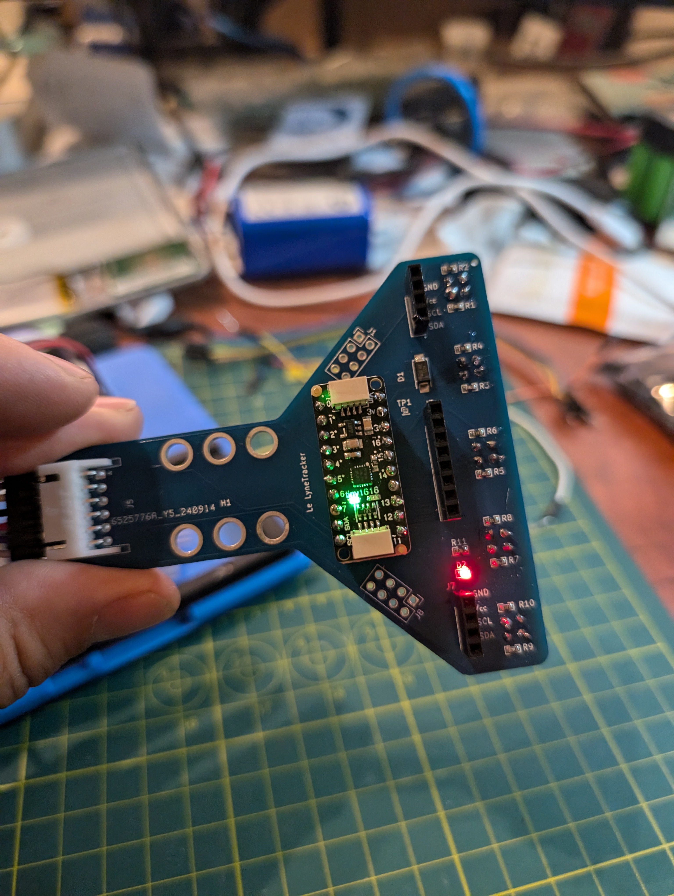

# Le capteur LyneTracker <!-- omit in toc -->
Cours sur l'utilisation du capteur de ligne LyneTracker avec le robot Ranger.

## Sommaire <!-- omit in toc -->
- [Introduction](#introduction)
  - [Caractéristiques techniques](#caractéristiques-techniques)
- [Utilisation dans le code](#utilisation-dans-le-code)
- [Suivre une ligne](#suivre-une-ligne)
  - [Méthode 1 : Suivre une ligne en fonction de la valeur des capteurs](#méthode-1--suivre-une-ligne-en-fonction-de-la-valeur-des-capteurs)
  - [Méthode 2 : Ajustement dynamique en fonction des lectures analogiques](#méthode-2--ajustement-dynamique-en-fonction-des-lectures-analogiques)
- [Utiliser l'écran SSD1306 avec le robot](#utiliser-lécran-ssd1306-avec-le-robot)
- [Exercices](#exercices)


# Introduction
Le LyneTracker est un capteur de ligne spécialement conçu au département pour les projets du cours de robotique. Il est compatible avec le robot Makeblock Ranger. Contrairement au capteur qui provient dans le kit original qui utilise des valeurs binaires (0 ou 1) pour détecter la ligne, le LyneTracker est équipé de **cinq capteurs infrarouges** qui retournent des **valeurs analogiques**, ce qui permet une détection plus précise de la position de la ligne.

Le LyneTracker fonctionne en utilisant la puce [**Adafruit Attiny1616 Seesaw**](https://www.adafruit.com/product/5690), qui nécessite l'utilisation de la librairie Seesaw fournie par Adafruit. Grâce à ses valeurs analogiques, il est possible d'obtenir une granularité plus fine et d'ajuster plus précisément la trajectoire du robot.

> **Note** : Étant en nombre relativement limité, on vous demande de ne pas retirer le module ATtiny1616 du LyneTracker, car cela pourrait l'endommager à la longue.

## Caractéristiques techniques
- **Nombre de capteurs** : 5 capteurs infrarouges.
- **Type de signal** : Analogique (lecture via `analogRead()`).
- **Compatibilité** : Nécessite la librairie [Seesaw d'Adafruit](https://github.com/adafruit/Adafruit_Seesaw).
- **Port de connexion** : Le LyneTracker se branche sur un port I2C du robot.

Voici à quoi ressemble le LyneTracker :




---

# Utilisation dans le code
Pour utiliser le LyneTracker dans sa forme la plus simple, il faut d'abord inclure la librairie Seesaw d'Adafruit dans votre projet Arduino. Ensuite, vous pouvez lire les valeurs analogiques de chaque capteur via la fonction `analogRead()`.

Exemple de code de base pour lire les valeurs des capteurs :

```cpp
#include <Adafruit_seesaw.h>

#define NB_IR 5

Adafruit_seesaw ss;
int sensorValues[NB_IR];  // Tableau pour stocker les valeurs des capteurs

void setup() {
    Serial.begin(115200);

    if (!ss.begin()) {
        Serial.println("Erreur de connexion au LyneTracker");
        while (1);
    }
    Serial.println("Connexion réussie au LyneTracker!");
}

void loop() {
    for (int i = 0; i < NB_IR; i++) {
        sensorValues[i] = ss.analogRead(i);
        Serial.print("IR"); Serial.print(i); Serial.print(":");
        Serial.print(sensorValues[i]);
        Serial.print("\t");
    }
    Serial.println();
    delay(100);
}
```

Dans cet exemple, les valeurs analogiques des cinq capteurs sont lues et affichées dans la console série. Ces valeurs varient en fonction de l'intensité de la réflexion de la lumière infrarouge (plus la valeur est basse, plus il est probable que le capteur détecte une ligne noire).

---

# Suivre une ligne
Il existe plusieurs méthodes pour suivre une ligne avec le LyneTracker. En voici deux, allant de la plus simple à la plus complexe.

## Méthode 1 : Suivre une ligne en fonction de la valeur des capteurs
Cette méthode consiste à lire les valeurs des capteurs et à ajuster le robot en fonction des seuils de détection. Si un capteur détecte une ligne noire (valeur basse), le robot tourne ou ajuste sa direction.

```cpp
void loop() {
    // Lire les capteurs
    for (int i = 0; i < 5; i++) {
        sensorValues[i] = ss.analogRead(i);
    }

    // Ajuster la direction en fonction des valeurs
    if (sensorValues[2] < 300) {
        // Le capteur du milieu voit la ligne, avancer
        Forward();
    } else if (sensorValues[0] < 300 || sensorValues[1] < 300) {
        // Les capteurs de gauche voient la ligne, tourner à gauche
        TurnLeft();
    } else if (sensorValues[3] < 300 || sensorValues[4] < 300) {
        // Les capteurs de droite voient la ligne, tourner à droite
        TurnRight();
    } else {
        // Aucun capteur ne voit la ligne, arrêter ou chercher la ligne
        Stop();
    }
}
```

## Méthode 2 : Ajustement dynamique en fonction des lectures analogiques
Cette méthode utilise une approche plus sophistiquée, en ajustant dynamiquement la vitesse du robot en fonction des valeurs analogiques pour une précision accrue.

```cpp
void loop() {
    int error = 0;
    
    // Lire les capteurs
    for (int i = 0; i < 5; i++) {
        sensorValues[i] = ss.analogRead(i);
    }

    // Calcul de l'erreur (pondération des capteurs)
    error = (sensorValues[0] * -2) + (sensorValues[1] * -1) + (sensorValues[3] * 1) + (sensorValues[4] * 2);

    // Ajuster la vitesse en fonction de l'erreur
    speedAdjust(moveSpeed, error);
}

void speedAdjust(int speed, int error) {
    int adjust = error / 10;  // Ajustement basé sur l'erreur
    encoderLeft.setMotorPwm(speed + adjust);  
    encoderRight.setMotorPwm(-speed - adjust);   
}
```

Dans cette méthode, les capteurs extérieurs ont un poids plus élevé, et l'ajustement de la trajectoire est basé sur l'erreur calculée.

---

# Utiliser l'écran SSD1306 avec le robot
Pour faciliter le débogage, vous pouvez également afficher les valeurs des capteurs sur l'écran OLED SSD1306, tout comme dans la leçon précédente.

```cpp
#include <Adafruit_SSD1306.h>

Adafruit_SSD1306 display(128, 64, &Wire);

void setup() {
    // Initialisation de l'écran
    if (!display.begin(SSD1306_SWITCHCAPVCC, 0x3C)) {
        Serial.println("SSD1306 allocation failed");
        for (;;);
    }
    display.display();
}

void loop() {
    display.clearDisplay();
    for (int i = 0; i < 5; i++) {
        display.setCursor(0, i * 10);
        display.print("Capteur ");
        display.print(i);
        display.print(": ");
        display.println(sensorValues[i]);
    }
    display.display();
}
```

---

# Exercices
1. Testez le code pour suivre une ligne noire sur fond blanc.
2. Ajustez le code pour que le robot suive une ligne plus précisément en utilisant la méthode d'ajustement dynamique.
3. Ajoutez de l'information de débogage, comme l'affichage des valeurs des capteurs sur l'écran SSD1306.
4. Implémentez un algorithme PID simplifié pour améliorer la précision du suivi de ligne.

---

[Retour au sommaire](../README.md)

---

Est-ce que cela correspond à tes attentes, ou souhaites-tu des ajustements ?